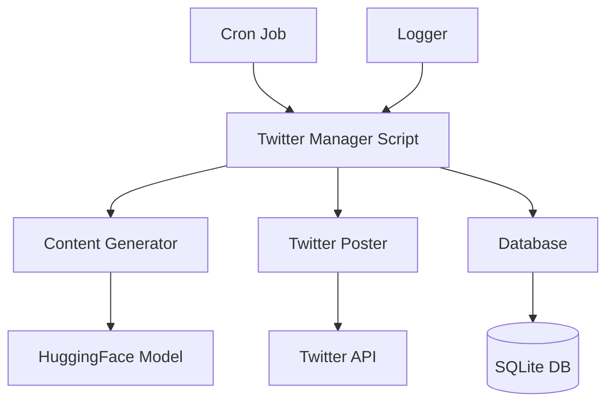
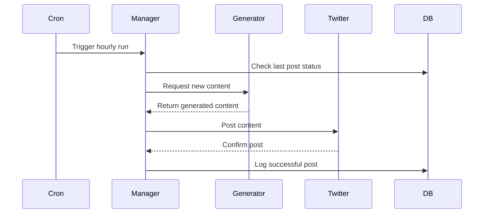

# Twitter Manager Architecture Plan

## System Components



## Component Details

1. **Main Script (`twitter_manager.py`)**
   - Orchestrates the entire process
   - Handles scheduling and execution
   - Implements error handling and retries
   - Configures logging

2. **Content Generator (`content_generator.py`)**
   - Implements HuggingFace model integration
   - Uses tech-focused models for content generation
   - Includes content filtering and validation
   - Ensures tweet length compliance

3. **Twitter Handler (`twitter_handler.py`)**
   - Manages Twitter API authentication
   - Handles posting to Twitter
   - Implements rate limiting
   - Verifies successful posts

4. **Database Manager (`db_manager.py`)**
   - Tracks posted content
   - Prevents duplicate posts
   - Stores posting history
   - Manages failed attempts

5. **Config Manager (`config.py`)**
   - Stores configuration settings
   - Manages API keys and secrets
   - Controls content generation parameters
   - Sets logging preferences

## Directory Structure
```
twitter_manager/
├── src/
│   ├── __init__.py
│   ├── twitter_manager.py
│   ├── content_generator.py
│   ├── twitter_handler.py
│   ├── db_manager.py
│   └── config.py
├── data/
│   └── twitter.db
├── logs/
│   └── twitter_manager.log
├── tests/
│   └── test_*.py
├── requirements.txt
├── README.md
└── .env
```

## Technical Specifications

1. **Dependencies**
   - `transformers`: HuggingFace models
   - `tweepy`: Twitter API integration
   - `sqlite3`: Database management
   - `python-dotenv`: Environment variable management
   - `logging`: System logging
   - `schedule`: Task scheduling

2. **Database Schema**
```sql
CREATE TABLE posts (
    id INTEGER PRIMARY KEY,
    content TEXT NOT NULL,
    posted_at TIMESTAMP,
    status TEXT,
    error_message TEXT
);
```

3. **Error Handling**
   - Automatic retries for failed API calls
   - Comprehensive error logging
   - Alert system for critical failures
   - Graceful degradation

4. **Security Measures**
   - Environment variables for sensitive data
   - API rate limit monitoring
   - Content validation before posting
   - Secure credential storage

## Implementation Flow



## Monitoring and Maintenance

1. **Logging Strategy**
   - Separate log files for different severity levels
   - Rotation policy for log files
   - Structured logging format
   - Performance metrics collection

2. **Maintenance Tasks**
   - Regular database cleanup
   - Log rotation
   - Model updates
   - API token renewal

3. **Performance Monitoring**
   - Success rate tracking
   - Response time monitoring
   - Resource usage tracking
   - Rate limit monitoring